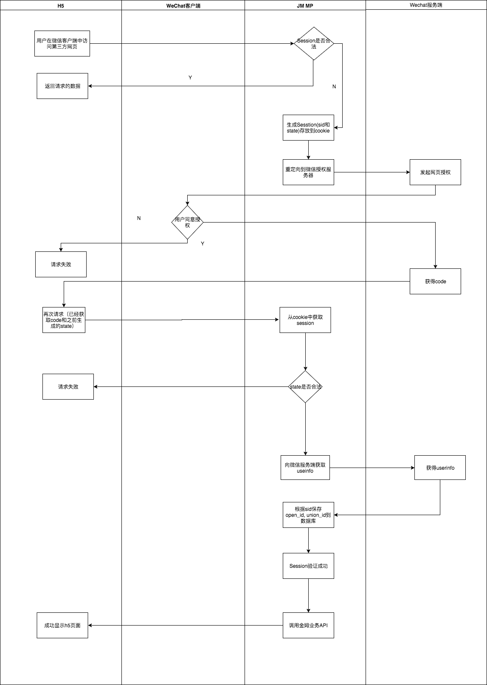

#  微信API设计文档

## 1.设计思路

用户在微信客户端中访问金姆h5页面，公众号可以通过微信网页授权机制，来获取用户基本信息，进而实现业务逻辑,基本的用户信息被保存到金姆服务器的数据库。

## 2.API接口

### 1.微信网页授权接口

* API格式
  * URL  /wx/oauth
  * 请求方式 Get
* 场景
  * 当微信客户端中访问金姆h5页面，金姆h5网页发起金姆业务api请求，其session不存在或者过期的时候，需要调用此接口，生成一个session并把sid 设置到cookie中的`jinmuhealth.com`的域中（金姆h5页面需要拿到金姆Server的生成的cookie，因此把cookie设置到2个子域的父域中），重定向给微信授权服务器发起用户授权请求，如果用户同意授权，会调用微信 OAuth 登录的回调响应接口。

### 2.微信网页授权回调接口

* API格式
  * URL  /wx/oauth/callback
  * 请求方式 Get
* 场景
  * 用户同意授权，重定向的回调该接口
  * Server获取请求的cookie中的sid，并通过数据库拿到保存的Session
  * Server获取请求的state,code，并判断session是否过期和state是否与保存到数据库Session的state是否一致
    * 不存在或者过期或者state不相同
      * 直接回调请求错误
    * 存在而没有过期且state相同
      * 通过code来获取open_id
      * 再通过open_id获取wxUser的信息和user_id，即验证通过Authorized为true
      * 更新open_id,UnionID,user_id，Authorized到数据库中的session
      * 当session保存成功后，调转到redirect_uri，也就是未授权时的访问接口
### 3.微信公众号服务器接入配置验证回调接口

* API格式

  * URL /wx
  *  请求方式 Get

* 场景

  * 微信为了验证金姆回调服务器的有效性
  * 验证步骤
    * 将token、timestamp、nonce三个参数进行字典序排序 2）将三个参数字符串拼接成一个字符串进行sha1加密 3）开发者获得加密后的字符串可与signature对比

### 4.获取JS-SDK的配置接口
* API格式

  * URL  /wx/api/jssdk/config
  * 请求方式 Post

* 场景

  * 返回给H5使用的JSSDK的配置信息 
  * 具体步骤
    * 用签名算法把url，随机生成的nonceStr，timestamp和当前的ticket，生成一个signature加入JS-SDK的配置
    * 并把AppID，nonceStr，timestamp和signature返回

### 5.获取测量历史记录信息

* API格式

  * URL  /wx/api/measurements
  * 请求方式 Get

* 场景

  * 获取测量的历史记录
  * 具体步骤
    * 判断Session是否过期或者不存在
      * 过期或者不存在
        * 重定向给微信授权服务器发起用户授权请求
      * 存在且没有过期
        * 通过请求url中quary（查询）上带的参数，查询数据库中的数据并返回

### 6.获取分析报告接口

* API格式
  * URL /wx/api/measurements/{record_id:int}/analyze
  * 请求方式 Get
* 场景
  * 获取分析报告
  * 具体步骤
    * 判断Session是否过期或者不存在	
      * 过期或者不存在
        * 重定向给微信授权服务器发起用户授权请求
      * 存在且没有过期
        * 通过请求的URL上Path的参数获取record_id，运行引擎，并返回

### 7.修改备注接口

* API格式
  * URL /wx/api/measurements/{record_id:int}/remark
  * 请求方式 Post
* 场景
  * 修改备注
  * 具体步骤
    * 判断Session是否过期或者不存在	
      * 过期或者不存在
        * 重定向给微信授权服务器发起用户授权请求
      * 存在且没有过期
        * 通过请求的URL上Path的参数获取record_id和请求body中的remark，更新数据库中的remark

### 8.支付接口（简化）

* API格式
  * URL /wx/api/payment
  * 请求方式 Post
* 场景
  * 查看具体的分析报告的时候，调用的支付接口
  * 具体步骤
    * 判断Session是否过期或者不存在
      * 过期或者不存在
        * 重定向给微信授权服务器发起用户授权请求
      * 存在且没有过期
        * 通过请求的URL上Path的参数获取record_id修改数据库record中的has_paid支付状态

